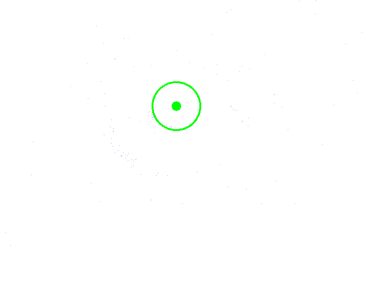
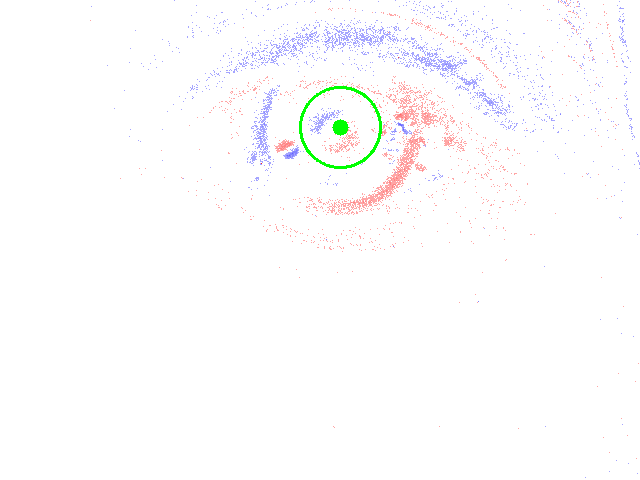
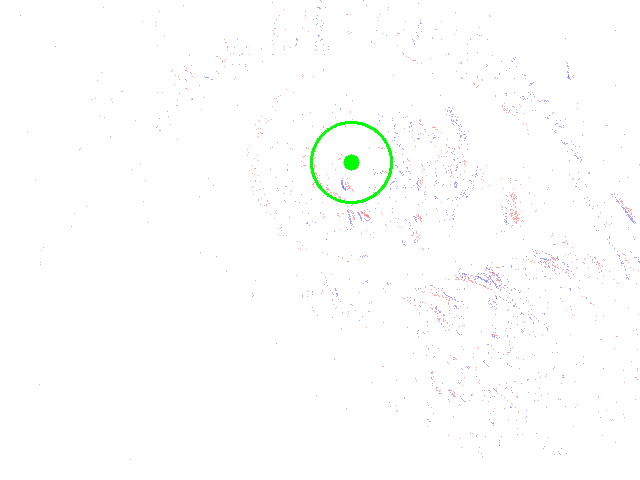
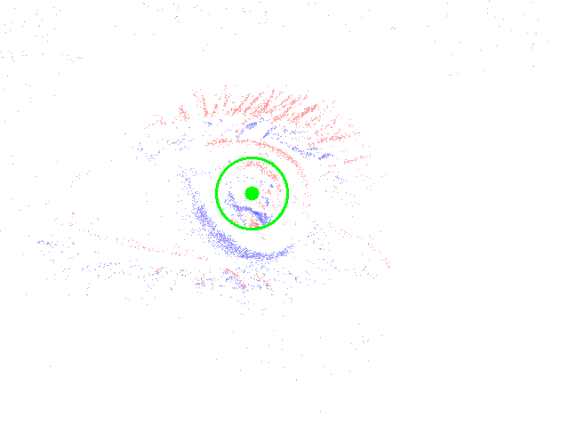

# Event-based Eye Tracking Challenge--Solution
This is the code for the Event-based Eye Tracking CVPR 2025 Challenge. 

## Requirements
The lines below should set up a fresh environment with everything you need:
```python
conda create --name eye_tracking python==3.10.0
conda activate eye_tracking
pip install torch==2.1.0 --index-url https://download.pytorch.org/whl/cu118
pip install -r requirements.txt
```

## Test
1. Download pre-trained [**model**](https://drive.google.com/drive/folders/16jHbCktdq34-BuuZgfpcV_ZOzQSFBlvm?usp=sharing) and place it in the `ckpt` directory.
2. Set the `data_dir` in `./configs/sliced_baseline.json` to the dataset path. The `metadata_dir` and `cache_dir` can be set freely for storing intermediate files to speed up training and inference.  
3. Ensure the checkpoint path in `./test.sh` points to the downloaded pre-trained model (`final.pth`), then run `./test.sh`. This will generate `submission_test.csv` and `inference_time.txt` in the `ckpt` directory.

**Attention: 
The results submitted to Kaggle were obtained using CUDA 11.8 and an NVIDIA 2080Ti GPU. Variations in inference results may occur with different GPUs, affecting the third decimal place. However, this has a negligible impact on the final $p_{error}$, within five decimal places.**

## Visualize
Set the paths for ‘data_dir‘ and ‘submission_file‘ in the visualize.py file, then run this.
```python
python visualize.py
```
This will create a folder prefixed with `vis_result`, containing visualization results for the test set. Green dots represent predicted values, and circles represent a range of 5 pixels.

|  |   |
| ------------------------------ | ------------------------------  |
|  |  |

## train
run this:
```python
./train.sh
```
